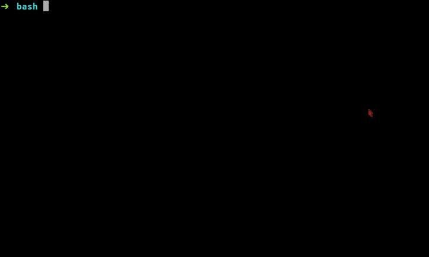

# Clean Cache and Buffer 

It will delete the cache in your local machine or remote machine, sometime cache takes too much memory.



## Getting Started

The below command in you command line:

```
git clone https://github.com/lifeeric/clean-buffer-cache.git

cd clean-buffer-cache

chmod a+x cleanc

sudo mv cleanc /bin

```

## Running the tests

run the below command to clean up:

```
sudo cleanc
```


## Built With

* [Bash Script] - Bash Shell script

## License

Free to use, modify, change!
